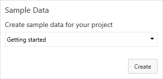
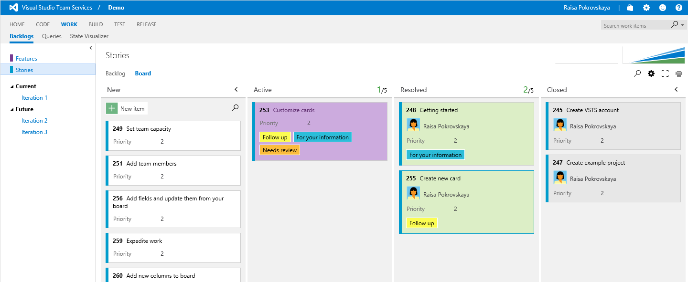
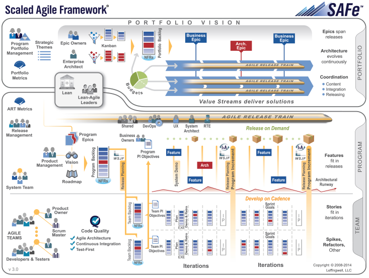

# Sample-Data-Widget-Extension

## Create and remove sample data 

Ever needed to have sample data to try things out on? Want to explore what Visual Studio Team Services can do? This extension lets you create and remove sample data in your project.

### Installation
* Install the extension in your VSTS account
* Edit a project dashboard and add the Sample Data widget
* Save the dashboard
* Use the widget controls to populate the project with sample data

 
## Sample Data Packages
The extension uses Sample data packages which you can create and remove to and from any project. 
Currently we have two packages out of the box: 

###Getting started with Agile & VSTS
Explore how you can create and work with work items and customize the agile boards.

###SAFe with VSTS
Learn how to use the Scaled Agile Framework with VSTS. Sample Data generates the sample data discussed in the [Implement Scaled Agile Framework® to support epics, release trains, and multiple backlogs](https://www.visualstudio.com/docs/work/scale/scaled-agile-framework) article.

Image courtesy of [Leffingwell, LLC](http://scaledagileframework.com/).

## Add your own Sample Data Packages ###

You can create and add your own custom Sample Data packages through the configuration pane.

We thank the following contributor(s) for this extension: Mattias Sköld, Niel Zeeman, Hassan Fadili and Igor Scheglovitov.

##Contribute
Contributions to Sample Data are welcome. Here is how you can contribute:  

- Submit bugs and help us verify fixes  
- Submit pull requests for bug fixes and features and discuss existing proposals   

Please refer to [Contribution guidelines](.github/CONTRIBUTING.md) and the [Code of Conduct](.github/COC.md) for more details.
