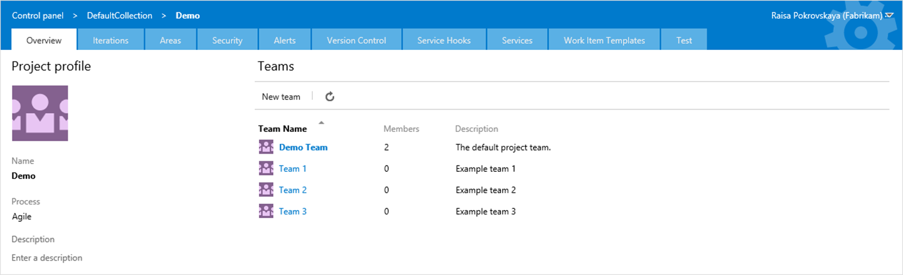

## Getting started with Agile ##
Explore what you can do with work items, see how teams can work together and how you can customize the cards with styles and tags.

We even have work items about how to create work items!

### Explore Teams and boards###
Explorer how different teams can customize the boards to suite their needs

> Microsoft DevLabs is an outlet for experiments from Microsoft, experiments that represent some of the latest ideas around developer tools. Solutions in this category are designed for broad usage, and you are encouraged to use and provide feedback on them; however, these extensions are not supported nor are any commitments made as to their longevity.

## Contributors ##

We thank the following contributor(s) for this extension: Mattias Sköld, Niel Zeeman, Hassan Fadili and Igor Scheglovitov.