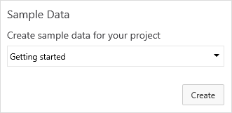

## Create and remove sample data ##

Ever needed to have sample data to try things out on? Want to explore what Visual Studio Team Services can do? This extension lets you create and remove sample data in your project.

After you have installed the extension, you can add the sample Data Widget to your dashboards and start to create and explore VSTS with the provided sample data.
 
## Sample Data Packages ##
The extension uses Sample data packages which you can create and remove to and from any project. 
Currently we have two packages out of the box: 

- ###Getting started with Agile & VSTS### 
Explore how you can create and work with work items and customize the agile boards.

- ###SAFe with VSTS###
Learn how to use the Scaled Agile Framework with VSTS. Sample Data generates the sample data discussed in the [Implement Scaled Agile Framework® to support epics, release trains, and multiple backlogs](https://www.visualstudio.com/docs/work/scale/scaled-agile-framework) article.

Image courtesy of [Leffingwell, LLC](http://scaledagileframework.com/).

## Add your own Sample Data Packages ###
***Currently we have disabled access to the configuration pane due to changes in how widgets handles configuration. We will bring back the capability to have your own custom Sample Data packages as soon as possible***

You can create and add your own custom Sample Data packages through the configuration pane.

## Contributors ##

The [source](https://github.com/ALM-Rangers/Sample-Data-Widget-Extension) to this extension is available. Feel free to take, fork, and extend.

> Microsoft DevLabs is an outlet for experiments from Microsoft, experiments that represent some of the latest ideas around developer tools. Solutions in this category are designed for broad usage, and you are encouraged to use and provide feedback on them; however, these extensions are not supported nor are any commitments made as to their longevity.

We thank the following contributor(s) for this extension: Mattias Sköld, Niel Zeeman, Hassan Fadili and Igor Scheglovitov.